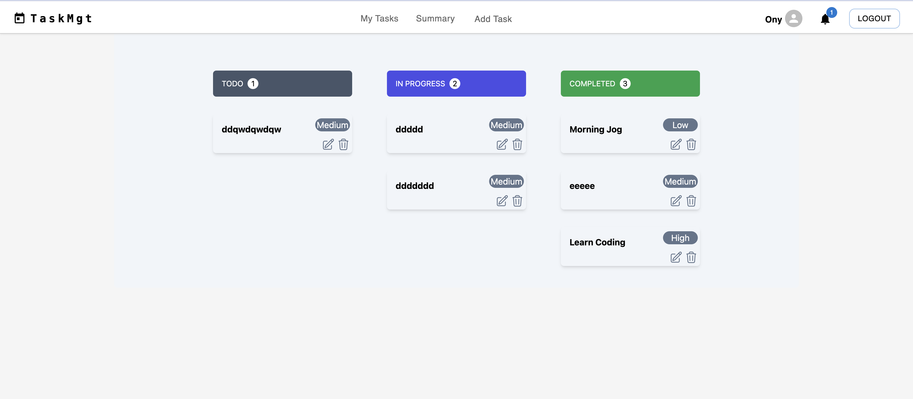
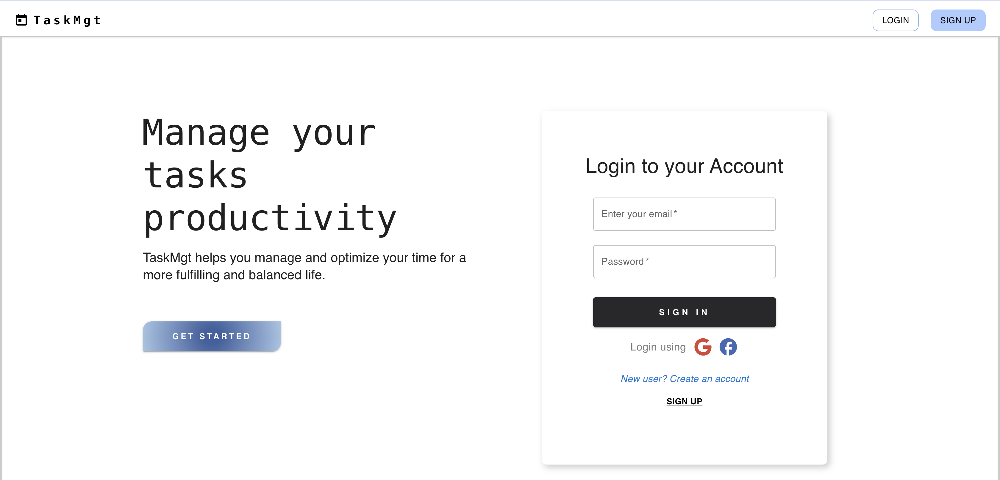
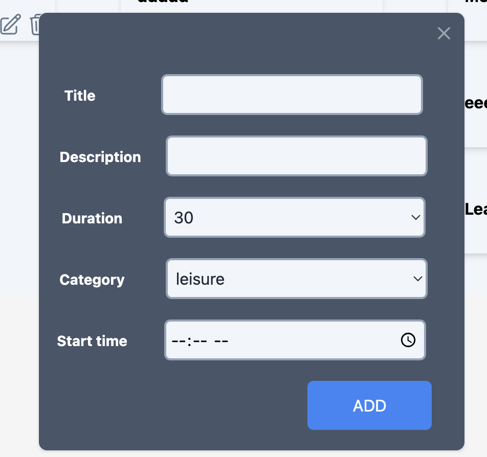
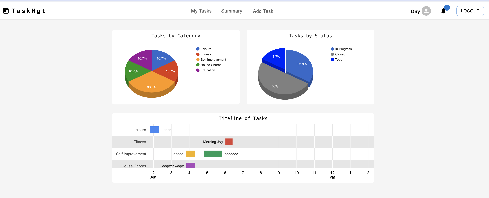
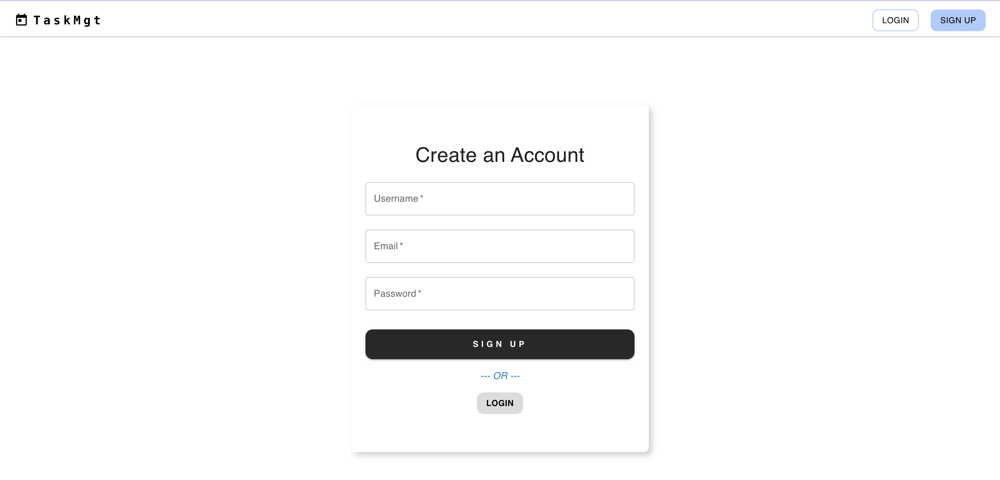

# Getting Started with TaskMgt App

TaskMgt is a full stack web application built with React that helps users manage and optimize their time for a more fulfilling and balanced life.

## Final Product

## Dependencies

- React
- Material UI
- Tailwind
- React-google-charts
- Node.js
- Express
- bcryptjs
- cookie-session

## Getting Started

- cd frontend
- cd backend
- Install all dependencies (using the `npm install` command).
- Run the development web server using the `npm start` command on Frontend and Backend.
